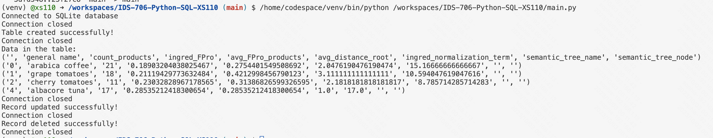
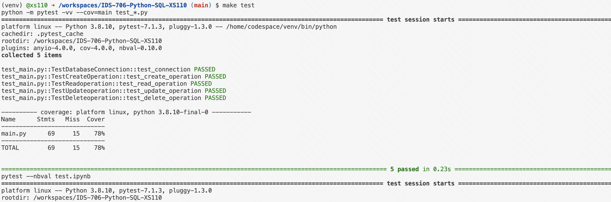

# Rewrite a Python Script in Rust


## Setup

I used my python template `IDS-706-SQL-XS110` as a template and made the following modifications: 

### 1. Install rust on VS code

First, I run the following in my terminal: 
```curl --proto '=https' --tlsv1.2 -sSf https://sh.rustup.rs | sh```

Then I went to extension panle and installed the rust-analyzer extension.


### 2.make a new file  main.rs


### 

## Results

[](https://github.com/nogibjj/IDS-706-Python-SQL-XS110/actions/workflows/cicd.yml)

### 1. successful database operations



### 2. passed all tests
