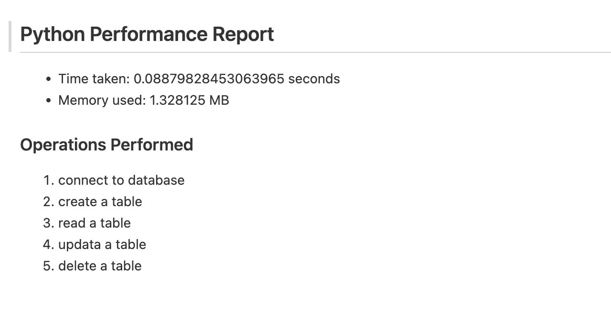
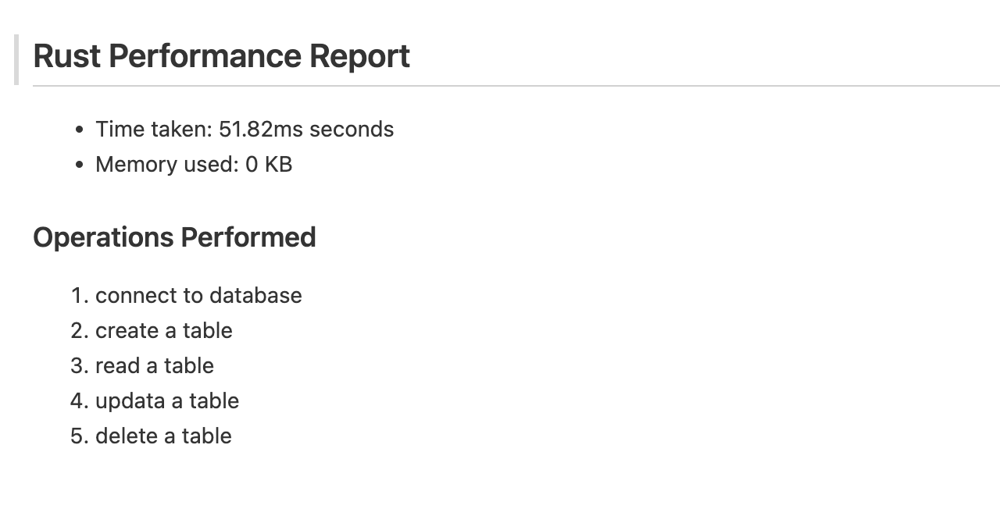
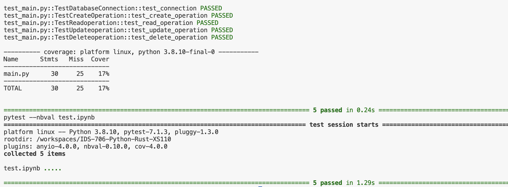
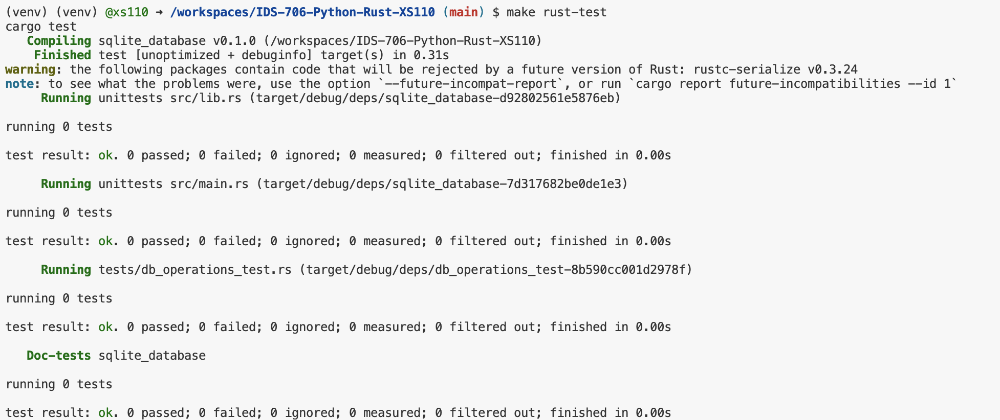

# Rewrite a Python Script in Rust

The code pertains to database operations on an SQLite database using the rusqlite library in Rust. Then, compare the time and memory usage of the same operation between python and rust. In conclusion, rust is more efficient than python.

## Setup

I used my python template `IDS-706-SQL-XS110` as a template and made the following modifications: 

### 1. Install rust on VS code

First, I run the following in my terminal: 
```curl --proto '=https' --tlsv1.2 -sSf https://sh.rustup.rs | sh```

Then I went to extension panle and installed the rust-analyzer extension.

### 3. create Cargo.tml

```
[package]
name = "sqlite_database" #crate name
version = "0.1.0"
edition = "2021"

# See more keys and their definitions at https://doc.rust-lang.org/cargo/reference/manifest.html

[dependencies]
rusqlite = "0.29"
libc = "^0.2"
time = "^0.1"
rand = "^0.3"
rustc-serialize = "^0.3"
rust-crypto = "^0.2"
clap = { version = "4.3.17", features = ["derive"] }
assert_cmd = "^2.0"
tempdir = "0.3"
predicates = "0.9"
sys-info = "0.7.0"
```
### 3.make a new file  lib.rs

Create a `src/lib.rs` file. Define the functions and the code provides utilities for basic CRUD (Create, Read, Update, Delete) operations on an SQLite database, focusing primarily on the "GroceryDB" table. In details, I make the functions in lib.rs public so they can be accessed from tests and main.rs. This involves adding pub in front of function definitions.

```rust
extern crate rusqlite;
use rusqlite::{params, Connection, Result};
pub fn connect_to_database() -> Result<Connection> {
    let conn = Connection::open("GroceryDB.db")?;
    println!("Connected to SQLite database");
    Ok(conn)
}

pub fn create_operation() -> Result<()> {
    let conn = Connection::open("newDB.db")?;
    conn.execute(
        "CREATE TABLE IF NOT EXISTS employees (
            id INTEGER PRIMARY KEY,
            name TEXT,
            department TEXT
        )",
        params![],
    )?;
    println!("Table created successfully!");
    Ok(())
}

pub fn read_operation() -> Result<()> {
    let conn = Connection::open("GroceryDB.db")?;
    let mut stmt = conn.prepare("SELECT * FROM GroceryDB LIMIT 5;")?;
    let rows = stmt.query_map(params![], |row| {
        Ok((
            row.get::<usize, String>(0)?,
            row.get::<usize, String>(1)?,
            row.get::<usize, String>(2)?,
            row.get::<usize, String>(3)?,
            row.get::<usize, String>(4)?,
            row.get::<usize, String>(5)?,
            row.get::<usize, String>(6)?,
            row.get::<usize, String>(7)?,
        ))
    })?;

    println!("Data in the table:");
    for row in rows {
        println!("{:?}", row?);
    }

    Ok(())
}

pub fn delete_operation() -> Result<()> {
    let conn = Connection::open("GroceryDB.db")?;
    conn.execute(
        "DELETE FROM GroceryDB WHERE general_name=?",
        params!["yellow bell pepper"],
    )?;
    println!("Record deleted successfully!");
    Ok(())
}
pub fn update_operation() -> Result<()> {
    let mut conn = Connection::open("GroceryDB.db")?;

    let data_to_insert = vec![
        (
            "general name",
            "count_products",
            "ingred_FPro",
            "avg_FPro_products",
            "avg_distance_root",
            "ingred_normalization_term",
            "semantic_tree_name",
            "semantic_tree_node",
        ),
        (
            "arabica coffee",
            "21",
            "0.18903204038025467",
            "0.2754401549508692",
            "2.0476190476190474",
            "15.16666666666667",
            "",
            "",
        ),
        (
            "grape tomatoes",
            "18",
            "0.21119429773632484",
            "0.4212998456790123",
            "3.111111111111111",
            "10.594047619047616",
            "",
            "",
        ),
    ];

    let tx = conn.transaction()?;
    for data in &data_to_insert {
        tx.execute(
            "INSERT INTO GroceryDB 
            (general_name, count_products, ingred_FPro, avg_FPro_products, 
            avg_distance_root, ingred_normalization_term, semantic_tree_name, 
            semantic_tree_node) VALUES (?1, ?2, ?3, ?4, ?5, ?6, ?7, ?8)",
            params![data.0, data.1, data.2, data.3, data.4, data.5, data.6, data.7],
        )?;
    }
    tx.commit()?;

    println!("Record updated successfully!");
    Ok(())
}
```

### 4.make a new file  main.rs

Create a `src/main.rs` file.

```rust
use sqlite_database::*;  // this is crate's library, which is now in lib.rs
use std::error::Error;
use std::time::Instant;

fn main() {
    match run_program() {
        Ok(1) => println!("Program executed successfully!"),
        Err(e) => eprintln!("Error occurred: {}", e),
        _ => eprintln!("Unknown error occurred."),
    }
}


pub fn run_program() -> Result<i32, Box<dyn Error>> {
    let start = Instant::now();
    let mem_info_before = sys_info::mem_info().unwrap();

    connect_to_database().unwrap();
    create_operation().unwrap();
    read_operation().unwrap();
    update_operation().unwrap();
    delete_operation().unwrap();
    
    let elapsed = start.elapsed();
    let mem_info_after = sys_info::mem_info().unwrap();
    let mem_used = mem_info_after.total - mem_info_before.total;

    std::fs::write(
        "rust_performance.md",
        format!(
            "## Rust Performance Report\n- Time taken: {:.2?} seconds\n- Memory used: {} KB\n### Operations Performed\n1. connect to database\n2. create a table\n3. read a table\n4. updata a table\n5. delete a table\n", 
            elapsed, mem_used
        )
    )?;

    Ok(1)
}


```

### 5. Modify Makefile and cicd.yml

I also modified Makefile to contain rules for building, testing, and running a project that has both Python and Rust components, and modified GitHub Actions CI configuration to automate building, linting, testing, formatting, and deploying for a project with both Python and Rust components

## Results

[](https://github.com/nogibjj/IDS-706-Python-Rust-XS110/actions/workflows/cicd.yml)

### 1. successful write the performance into markdown
#### [python_performance.md](https://github.com/nogibjj/IDS-706-Python-Rust-XS110/blob/main/python_performance.md)


#### [rust_performance.md](https://github.com/nogibjj/IDS-706-Python-Rust-XS110/blob/main/rust_performance.md)



### 2. passed all tests

#### python:

#### Rust:


### 3. Summary the improvement
Python takes 0.088s and 1.328MB memory, but rust takes 55.82 ms and 0 MB memory

According to the time and memory usage results, rust is much more efficient than python, it didn't use any memory using MB unit and much faster than python.